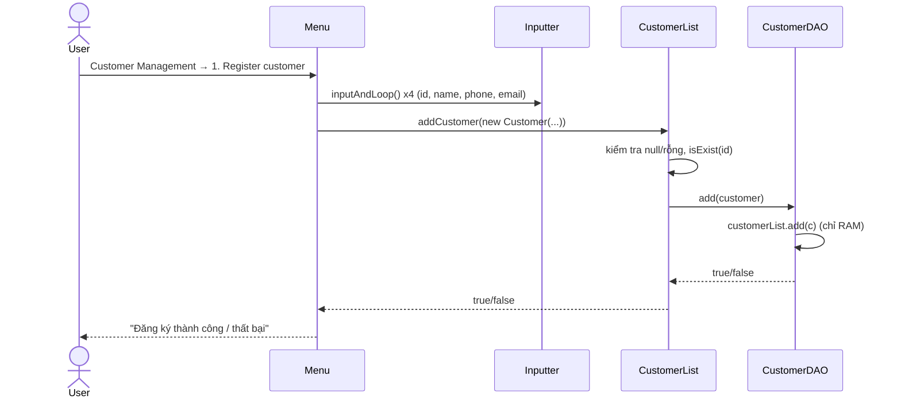
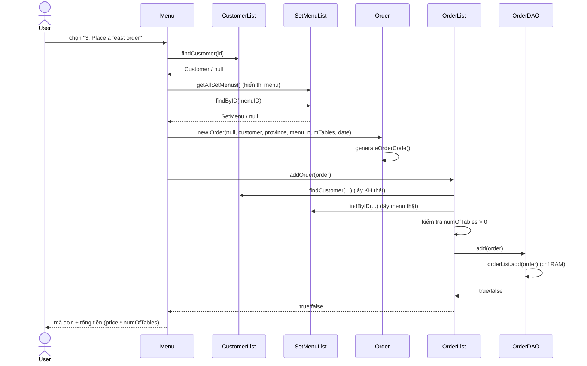
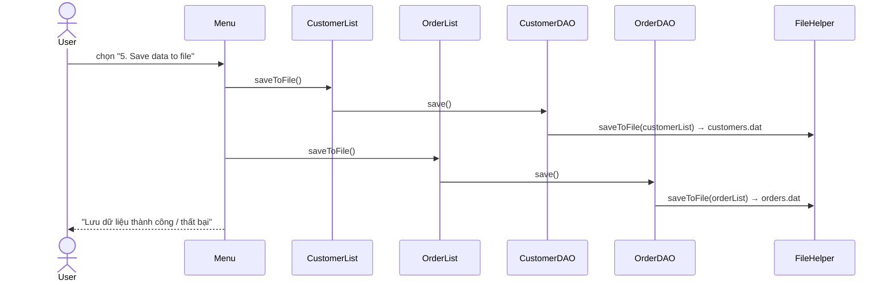

# THIẾT KẾ HỆ THỐNG — TRADITIONAL FEAST ORDER MANAGEMENT

> Dự án quản lý đặt tiệc (Java 8 console, NetBeans/Ant). Tài liệu này được viết lại theo
> source code hiện tại, gồm: Entity → Attribute → Class → Fields, Design Pattern (phân tầng),
> Constructor Injection, Sequence Diagram, cách chạy và các hạn chế đã biết.

---

## 0. TỔNG QUAN

| Hạng mục | Thông tin |
|---|---|
| Ngôn ngữ | Java 8 |
| Build | Apache Ant (NetBeans project), `main.class = Presentation.Program` |
| Kiểu ứng dụng | Console, đơn luồng |
| Lưu trữ | `customers.dat`, `orders.dat` (Java Serialization) và `FeastMenu.csv` (CSV UTF-8) |
| **Cơ chế lưu** | **Thao tác trên RAM; chỉ ghi file khi chọn chức năng "5. Save data to file"** |
| Test | JUnit 4.13.2 + Mockito 3.12.4 (`test/BusinessObject/CustomerListTest.java`) |
| Container | `Dockerfile` (`eclipse-temurin:8-jdk-jammy`, build bằng `ant jar`) |

> ⚠️ **Thay đổi so với bản cũ:** DAO không còn ghi file sau mỗi `add/update/delete`.
> Dữ liệu chỉ nằm trong RAM cho đến khi người dùng chọn **Save**. Thoát chương trình
> (chọn `0`) **không tự động lưu**.

---

## 1. ENTITY → ATTRIBUTE → CLASS → FIELDS

Package: `Core.Entities`. Cả 3 lớp implement `Serializable` (`serialVersionUID = 1L`)
vì được ghi xuống file nhị phân bằng `ObjectOutputStream`.

### 1.1. Customer (Khách hàng) — `Core.Entities.Customer`

| Field   | Kiểu   | Mô tả                                   |
|---------|--------|------------------------------------------|
| `id`    | String | Mã khách hàng (VD: `C0001`)              |
| `name`  | String | Tên khách hàng                           |
| `phone` | String | Số điện thoại (10 số, đầu số nhà mạng VN) |
| `email` | String | Email                                    |

Constructor: `Customer()`, `Customer(id, name, phone, email)`. Có getter/setter và `toString()`.

### 1.2. SetMenu (Set menu tiệc) — `Core.Entities.SetMenu`

| Field         | Kiểu   | Mô tả                                  |
|---------------|--------|-----------------------------------------|
| `menuID`      | String | Mã set menu (VD: `PW001`)               |
| `menuName`    | String | Tên set menu                            |
| `price`       | double | Giá mỗi bàn                             |
| `ingredients` | String | Nguyên liệu, phân cách bằng `#`, `+ `, `; ` |

`toString()` gọi `formatIngredients()` để hiển thị danh sách món xuống dòng, dễ đọc.

### 1.3. Order (Đơn đặt tiệc) — `Core.Entities.Order`

| Field         | Kiểu     | Mô tả                                              |
|---------------|----------|-----------------------------------------------------|
| `orderCode`   | String   | Mã đơn, tự sinh theo pattern `yyyyMMddHHmmss`        |
| `customerID`  | Customer | Object khách hàng nhúng trực tiếp (không chỉ là ID)  |
| `province`    | String   | Tỉnh/thành tổ chức tiệc                             |
| `menuID`      | SetMenu  | Object set menu nhúng trực tiếp                     |
| `numOfTables` | int      | Số bàn                                              |
| `eventDate`   | Date     | Ngày giờ tổ chức (`dd/MM/yyyy HH:mm`)               |

- `generateOrderCode()` (private): `new SimpleDateFormat("yyyyMMddHHmmss").format(new Date())`.
  (`MM` = tháng, `mm` = phút, `HH` = giờ 24h.)
- `Order()` → tự sinh mã, `customerID = menuID = null`, `eventDate = new Date()`.
- `Order(orderCode, customerID, province, menuID, numOfTables, eventDate)` → **tham số
  `orderCode` bị bỏ qua**, constructor luôn tự sinh mã mới (vì vậy `Menu` truyền `null`).

> Lưu ý đặt tên: `customerID` có kiểu `Customer` và `menuID` có kiểu `SetMenu`
> (tên là "ID" nhưng giữ cả object).

### 1.4. Quan hệ giữa các Entity

`Order` **chứa (composition)** `Customer` và `SetMenu` dưới dạng object thật. Khi thêm đơn,
`OrderList.addOrder()` lấy lại object thật từ `CustomerList`/`SetMenuList` và gán đè vào
`Order` để tránh Order chứa object "rỗng" (chỉ có mã).

---

## 2. DESIGN PATTERN — PHÂN TẦNG TRÁCH NHIỆM

```
Presentation (Program / Menu)
        │  gọi
        ▼
BusinessObject  ── CONTROL (RAM) ── logic nghiệp vụ, validate
        │  gọi qua interface DAO (Dependency Inversion)
        ▼
DataObjects     ── SAVE ── giữ list trong RAM; ghi file khi save()
        │  dùng qua interface IFileIO
        ▼
Utilities.FileIO (FileHelper, MenuFileHelper)  +  Core.Entities
```

### 2.1. STORE ENTITY — package `Core`

- **`Core.Entities`**: `Customer`, `SetMenu`, `Order`.
- **`Core.Interfaces`**:

```java
public interface IBaseDAO<E> {
    List<E> readAll();
    boolean writeAll(List<E> list);
    boolean save();                 // ghi list trong RAM xuống file
    boolean add(E item);
    boolean update(E item);
    boolean delete(String id);
    E findByID(String id);
}
```

- `ICustomerDAO extends IBaseDAO<Customer>` — thêm `findByName(String)`.
- `IOrderDAO extends IBaseDAO<Order>` — thêm `findByCustomerID(String)`.
- `ISetMenuDAO extends IBaseDAO<SetMenu>` — không thêm method riêng.

### 2.2. CONTROL (RAM) — package `BusinessObject`

Service/Business Layer. Validate và xử lý nghiệp vụ, **không tự đọc/ghi file**.

| Class | Field phụ thuộc | Method chính |
|---|---|---|
| `CustomerList` | `ICustomerDAO` | `addCustomer`, `updateCustomer`, `deleteCustomer`, `searchByName`, `getAllCustomers`, `findCustomer`, `isExist`, `saveToFile` |
| `SetMenuList` | `ISetMenuDAO` | `getAllSetMenus`, `findByID` |
| `OrderList` | `IOrderDAO` + `CustomerList` + `SetMenuList` | `addOrder`, `updateOrder`, `deleteOrder`, `getAllOrders`, `findOrder`, `calcOrderTotal`, `isExist`, `getOrdersByCustomer`, `getTotalRevenue`, `saveToFile` |

`OrderList.addOrder(Order o)`:
1. Kiểm tra `o`, `customerID`, `menuID` không null.
2. Kiểm tra `orderCode` chưa tồn tại (`isExist`).
3. `customerList.findCustomer(...)` → lấy customer thật, không có thì thất bại.
4. `setMenuList.findByID(...)` → lấy menu thật, không có thì thất bại.
5. Kiểm tra `numOfTables > 0`.
6. `o.setCustomerID(realCustomer)`, `o.setMenuID(realMenu)`.
7. `orderDAO.add(o)` — **chỉ thêm vào RAM**.

`saveToFile()` của `CustomerList`/`OrderList` chỉ ủy quyền xuống `dao.save()`.

### 2.3. SAVE — package `DataObjects`

DAO Pattern: tách logic lưu trữ khỏi nghiệp vụ.

| Class | Implements | File dữ liệu | Helper |
|---|---|---|---|
| `CustomerDAO` | `ICustomerDAO` | `src/DataObjects/Data/customers.dat` | `FileHelper<Customer>` |
| `OrderDAO` | `IOrderDAO` | `src/DataObjects/Data/orders.dat` | `FileHelper<Order>` |
| `SetMenuDAO` | `ISetMenuDAO` | `src/DataObjects/Data/FeastMenu.csv` | `MenuFileHelper` |

Cấu trúc chung của 3 DAO:
- Field `IFileIO<E> fileIO` (khai báo theo interface) và `List<E>` trong RAM.
- Constructor gọi `loadFromFile()` **một lần** để nạp file vào RAM.
- `readAll()` trả bản sao list (`new ArrayList<>(list)`), không đọc file.
- `add/update/delete` **chỉ thao tác trên RAM**.
- `save()` → `writeAll(list)` → `fileIO.saveToFile(list)`: ghi xuống file.
- `findByID` dùng Stream `.filter(...).findFirst().orElse(null)`.

### 2.4. UTILS — package `Utilities`

- **`Utilities.FileIO`**
  - `IFileIO<E>`: `readFromFile()`, `saveToFile(List<E>)`.
  - `FileHelper<E>`: đọc/ghi nhị phân (Serialization), dừng đọc khi bắt `EOFException`;
    file không tồn tại thì trả list rỗng.
  - `MenuFileHelper implements IFileIO<SetMenu>`: đọc/ghi CSV UTF-8, bỏ dòng header,
    strip BOM, parse bằng `split(",", -1)`.
- **`Utilities.Validation`**
  - `BaseValidation`: `INTEGER_VALID`, `POSITIVE_INT_VALID`, `DOUBLE_VALID`,
    `POSITIVE_DOUBLE_VALID`, `static isValid(value, pattern)`.
  - `CusValidation`: `CUS_ID_VALID`, `NAME_VALID`, `EMAIL_PATTERN`, `PHONE_VALID`
    (đầu số Viettel/Vinaphone/Mobifone + 7 số).
  - `OrderValidation`: `PROVINCE_VALID`, `NUM_TABLES_VALID`,
    `DATE_VALID` (`dd/MM/yyyy HH:mm`).
- **`Utilities.Inputter`** — đọc bàn phím bằng `Scanner` gắn UTF-8:
  `getString`, `getInt`, `getDouble`, `inputAndLoop(mess, pattern, loop)`.
  `getInt`/`getDouble` **không loop**, trả về `0` khi nhập sai; `inputAndLoop` với
  `loop = true` sẽ nhập lại đến khi khớp regex.

### 2.5. Presentation

- `Program` — entry point và **composition root** (xem mục 3): set `System.out` sang UTF-8,
  tạo các object và truyền vào `Menu`.
- `Menu` — vòng lặp menu console. Chỉ nhập/xuất và gọi `BusinessObject`.

Menu chính:

| Lựa chọn | Chức năng |
|---|---|
| 1 | Customer Management (submenu) |
| 2 | Display feast menus |
| 3 | Place a feast order |
| 4 | Update order information |
| 5 | **Save data to file** (gọi `customerList.saveToFile()` + `orderList.saveToFile()`) |
| 6 | Display order list |
| 7 | Display invoice list (kèm tổng doanh thu) |
| 0 | Quit (**không tự lưu**) |

Submenu Customer Management: 1 Register, 2 Update, 3 Search by name, 4 Delete,
5 Display list, 0 Back.

---

## 3. CONSTRUCTOR INJECTION

Các lớp Business nhận dependency qua constructor, field khai báo `final` và theo **interface**:

```java
public class CustomerList {
    private final ICustomerDAO customerDAO;
    public CustomerList(ICustomerDAO customerDAO) { this.customerDAO = customerDAO; }
}

public class OrderList {
    private final IOrderDAO orderDAO;
    private final CustomerList customerList;
    private final SetMenuList setMenuList;
    public OrderList(IOrderDAO orderDAO, CustomerList customerList, SetMenuList setMenuList) { ... }
}
```

Toàn bộ việc lắp ráp nằm ở `Program.main` (composition root):

```java
Inputter in = new Inputter();
CustomerList customerList = new CustomerList(new CustomerDAO());
SetMenuList  setMenuList  = new SetMenuList(new SetMenuDAO());
OrderList    orderList    = new OrderList(new OrderDAO(), customerList, setMenuList); // dùng chung 2 object trên
Menu menu = new Menu(in, customerList, orderList, setMenuList);
menu.run();
```

Đồ thị phụ thuộc:

```
Program ──► Menu ──► CustomerList ──► ICustomerDAO ◄── CustomerDAO
                 ├─► SetMenuList  ──► ISetMenuDAO  ◄── SetMenuDAO
                 └─► OrderList ───► IOrderDAO      ◄── OrderDAO
                        ├─► CustomerList (dùng chung instance)
                        └─► SetMenuList  (dùng chung instance)
```

Lợi ích:
- **Dùng chung một instance** `CustomerList`/`SetMenuList` giữa `Menu` và `OrderList` nên RAM
  nhất quán, **không cần Singleton** cho DAO.
- **Dễ test:** `CustomerListTest` truyền `@Mock ICustomerDAO` vào constructor, không đụng file thật.

---

## 4. SEQUENCE DIAGRAM

### 4.1. Đăng ký khách hàng (Customer Management → 1)



Chưa ghi file. Dữ liệu chỉ được lưu khi chọn **5. Save data to file**.

### 4.2. Đặt tiệc (chức năng 3 — `placeOrder`)



### 4.3. Lưu dữ liệu (chức năng 5 — `saveData`)



Chỉ Customer và Order được ghi. `SetMenu` là dữ liệu tham chiếu (`FeastMenu.csv`),
`Menu.saveData()` không gọi lưu cho nó.

### 4.4. Xóa đơn hàng (`OrderList.deleteOrder`)

Không có mục menu riêng, nhưng luồng nghiệp vụ có sẵn:
1. `OrderList.deleteOrder(orderCode)` → `isExist(orderCode)` (gọi `orderDAO.findByID`).
2. `OrderDAO.delete(orderCode)` → `orderList.removeIf(...)` (chỉ RAM).
3. Cần **Save** để ghi thay đổi xuống `orders.dat`.

---

## 5. CẤU TRÚC THƯ MỤC

```
Project/
├── src/
│   ├── Core/
│   │   ├── Entities/      Customer, Order, SetMenu
│   │   └── Interfaces/    IBaseDAO, ICustomerDAO, IOrderDAO, ISetMenuDAO
│   ├── BusinessObject/    CustomerList, OrderList, SetMenuList
│   ├── DataObjects/       CustomerDAO, OrderDAO, SetMenuDAO
│   │   └── Data/          customers.dat, orders.dat, FeastMenu.csv
│   ├── Utilities/
│   │   ├── FileIO/        IFileIO, FileHelper, MenuFileHelper
│   │   ├── Validation/    BaseValidation, CusValidation, OrderValidation
│   │   └── Inputter.java
│   └── Presentation/      Program, Menu
├── test/BusinessObject/   CustomerListTest
├── lib/                   junit, hamcrest, mockito, byte-buddy, objenesis
├── nbproject/, build.xml, manifest.mf
├── Dockerfile
└── README.md
```

---

## 6. ENCODING TIẾNG VIỆT

- `Inputter` dùng `new Scanner(new InputStreamReader(System.in, StandardCharsets.UTF_8))`.
- `Program.main` set `System.out` thành `PrintStream(..., true, "UTF-8")`
  (Java 8: overload nhận `String`, bọc `try/catch UnsupportedEncodingException`).
- `MenuFileHelper` đọc/ghi CSV bằng UTF-8.
- Terminal cũng phải là UTF-8 (Windows Terminal / `chcp 65001` / NetBeans Output UTF-8).
  Dockerfile đã đặt `LANG=C.UTF-8`, `LC_ALL=C.UTF-8`.

---

## 7. BUILD, CHẠY, TEST

```bash
# Build jar (Ant)
ant -f build.xml jar

# Chạy (phải chạy từ thư mục gốc vì đường dẫn file là tương đối)
java -cp dist/Project.jar Presentation.Program

# Docker
docker build -t feast .
docker run -it feast
```

- Unit test: chạy trong NetBeans (Test Project) hoặc `ant test`.
- Vì đường dẫn dữ liệu là `src/DataObjects/Data/...`, container mới **mất dữ liệu khi bị xóa**
  trừ khi mount volume: `docker run -it -v feast-data:/app/src/DataObjects/Data feast`.

---

## 8. HẠN CHẾ ĐÃ BIẾT

- **Chưa Save thì mất dữ liệu:** thoát bằng `0` không tự lưu.
- `Inputter.getInt` không loop: nhập sai số bàn trả về `0`. `OrderList.updateOrder` chưa
  kiểm tra `numOfTables > 0`.
- `readAll()` trả bản sao list nhưng phần tử vẫn là object gốc, nên sửa trực tiếp object lấy
  từ `findCustomer`/`findOrder` sẽ thay đổi dữ liệu trong RAM.
- `Order` nhúng nguyên `Customer`/`SetMenu`: sau khi lưu và mở lại, các object này là bản sao
  độc lập với `customers.dat`. Xóa khách hàng không kiểm tra đơn liên quan.
- Tầng Business còn `System.out.println` (nên để tầng Presentation in).
- `Order(orderCode, ...)` bỏ qua tham số `orderCode`.
- Mã đơn sinh theo giây nên có thể trùng nếu tạo 2 đơn trong cùng một giây.
- `CUS_ID_VALID = "^[CCGgKk]\\d{4}$"` lặp chữ `C` và chấp nhận chữ thường.
- `BusinessObject` còn import thừa các class `DataObjects.*` (không dùng).
- Đường dẫn file hardcode tương đối, phụ thuộc working directory.