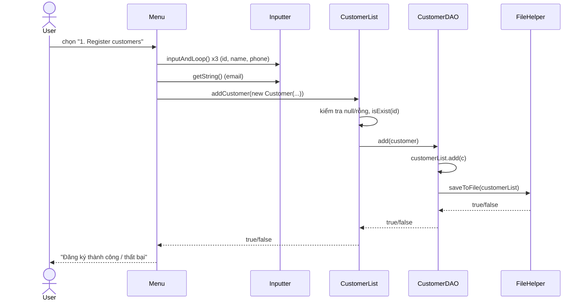
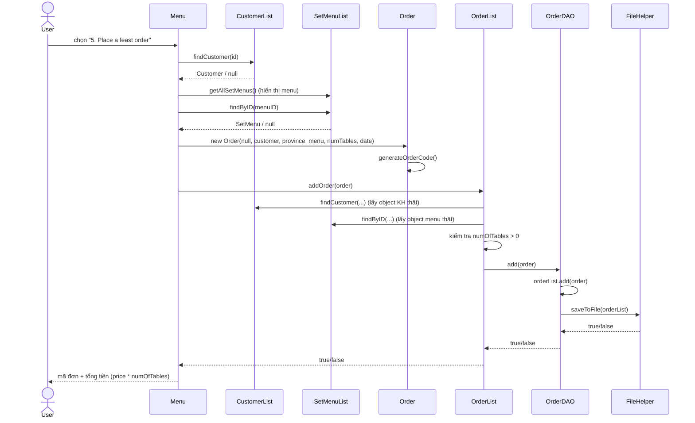

# THIẾT KẾ HỆ THỐNG — TRADITIONAL FEAST ORDER MANAGEMENT

> Dự án quản lý đặt tiệc (Java console, NetBeans/Ant). Tài liệu này phân tích trực tiếp từ
> source code hiện có, theo 3 mục: Entity → Attribute → Class → Fields, Design Pattern
> (4 tầng), và Sequence Diagram (luồng xử lý — class nào, method nào).

---

## 1. ENTITY → ATTRIBUTE → CLASS → FIELDS

Package chứa entity: `Core.Entities`. Cả 3 lớp đều implement `Serializable`
(bắt buộc vì dữ liệu được ghi xuống file nhị phân bằng `ObjectOutputStream`).

### 1.1. Customer (Khách hàng)

`Core.Entities.Customer`

| Field   | Kiểu   | Mô tả              |
|---------|--------|--------------------|
| `id`    | String | Mã khách hàng (VD: C0001) |
| `name`  | String | Tên khách hàng     |
| `phone` | String | Số điện thoại (10 số) |
| `email` | String | Email              |

Constructor: `Customer()`, `Customer(String id, String name, String phone, String email)`.
Có đầy đủ getter/setter cho từng field và `toString()` override.

### 1.2. SetMenu (Set menu / thực đơn tiệc)

`Core.Entities.SetMenu`

| Field         | Kiểu   | Mô tả                 |
|---------------|--------|-----------------------|
| `menuID`      | String | Mã set menu (VD: M01) |
| `menuName`    | String | Tên món tiệc          |
| `price`       | double | Giá tiền              |
| `ingredients` | String | Nguyên liệu           |

Constructor: `SetMenu()`, `SetMenu(String menuID, String menuName, double price, String ingredients)`.

### 1.3. Order (Đơn đặt tiệc)

`Core.Entities.Order`

| Field         | Kiểu     | Mô tả                                             |
|---------------|----------|----------------------------------------------------|
| `orderCode`   | String   | Mã đơn, tự sinh theo pattern `yyyymmddhhmmss`      |
| `customerID`  | Customer | Object khách hàng nhúng trực tiếp (không phải chỉ String ID) |
| `province`    | String   | Tỉnh/thành tổ chức tiệc                            |
| `menuID`      | SetMenu  | Object set menu nhúng trực tiếp                    |
| `numOfTables` | int      | Số bàn                                             |
| `eventDate`   | Date     | Ngày tổ chức                                       |

Method riêng: `generateOrderCode()` (private) — sinh mã đơn từ `new Date()` qua
`SimpleDateFormat("yyyymmddhhmmss")`.

Constructor:
- `Order()` → tự gọi `generateOrderCode()`, `menuID = null`, `customerID = null`, `eventDate = new Date()`.
- `Order(orderCode, customerID, province, menuID, numOfTables, eventDate)` → **tham số
  `orderCode` truyền vào bị bỏ qua**, constructor luôn gọi lại `generateOrderCode()` để
  tự sinh mã mới.

### 1.4. Quan hệ giữa các Entity

`Order` **chứa (composition)** `Customer` và `SetMenu` dưới dạng object thật (nhờ cả
hai đều implement `Serializable`), chứ không chỉ lưu String ID. Khi thêm đơn,
`OrderList.addOrder()` sẽ lấy lại object thật từ `CustomerList`/`SetMenuList` và gán đè
vào `Order` để tránh trường hợp Order chứa object "rỗng" (chỉ có mã, không có dữ liệu).

---

## 2. DESIGN PATTERN — PHÂN TẦNG TRÁCH NHIỆM

Kiến trúc chia 4 nhóm theo chiều dữ liệu đi từ giao diện xuống file, cộng với tầng
Presentation ở trên cùng (không tính là 1 trong 4 nhóm core nhưng là entry point).

```
Presentation (Menu / Program)
        │  gọi
        ▼
BusinessObject  ── CONTROL (RAM) ── logic nghiệp vụ, validate
        │  gọi qua interface DAO (Dependency Inversion)
        ▼
DataObjects     ── SAVE (FILE)  ── đọc/ghi file nhị phân
        │  dùng
        ▼
Utilities.FileIO.FileHelper  +  Core.Entities  ── STORE ENTITY / UTILS
```

### 2.1. STORE ENTITY — package `Core`

Chỉ định nghĩa "hình dáng" dữ liệu và hợp đồng (interface), không chứa logic xử lý.

- **`Core.Entities`**: `Customer`, `SetMenu`, `Order` — các entity ở mục 1.
- **`Core.Interfaces`**:
  - `IBaseDAO<E>` — interface generic dùng chung cho mọi DAO:
    ```java
    public interface IBaseDAO<E> {
        List<E> readAll();
        boolean writeAll(List<E> list);
        boolean add(E item);
        boolean update(E item);
        boolean delete(String id);
        E findByID(String id);
    }
    ```
  - `ICustomerDAO extends IBaseDAO<Customer>` — thêm `findByName(String)`.
  - `IOrderDAO extends IBaseDAO<Order>` — thêm `findByCustomerID(String)`.
  - `ISetMenuDAO extends IBaseDAO<SetMenu>` — không mở rộng thêm method riêng.

**Mục đích:** tách hợp đồng khỏi cách thực thi cụ thể → các tầng trên (BusinessObject)
phụ thuộc vào interface (`ICustomerDAO`...) chứ không phụ thuộc trực tiếp vào
`CustomerDAO` (Dependency Inversion Principle).

### 2.2. CONTROL (RAM) — package `BusinessObject`

Đóng vai trò "Service / Business Layer". Giữ list trong RAM thông qua DAO, validate và
xử lý nghiệp vụ, **không tự đọc/ghi file**.

| Class | Field DAO | Method chính |
|---|---|---|
| `CustomerList` | `ICustomerDAO customerDAO` | `addCustomer`, `updateCustomer`, `deleteCustomer`, `searchByName`, `getAllCustomers`, `findCustomer`, `isExist`, `isNullOrEmpty` (private) |
| `SetMenuList` | `ISetMenuDAO setMenuDAO` | `addSetMenu`, `updateSetMenu`, `deleteSetMenu`, `getAllSetMenus`, `findByID`, `isExist`, `isNullOrEmpty` (private) |
| `OrderList` | `IOrderDAO orderDAO` + compose thêm `CustomerList customerList`, `SetMenuList setMenuList` | `addOrder`, `updateOrder`, `deleteOrder`, `getAllOrders`, `findOrder`, `isExist`, `getOrdersByCustomer`, `getTotalRevenue` |

Điểm đáng chú ý trong `OrderList.addOrder(Order o)`:
1. Kiểm tra `o`, `customerID`, `menuID` không null.
2. Kiểm tra `orderCode` chưa tồn tại (`isExist`).
3. Gọi `customerList.findCustomer(o.getCustomerID().getId())` để lấy **customer thật** từ DB.
4. Gọi `setMenuList.findByID(o.getMenuID().getMenuID())` để lấy **menu thật** từ DB.
5. Kiểm tra `numOfTables > 0`.
6. Gán đè `o.setCustomerID(realCustomer)`, `o.setMenuID(realMenu)`.
7. Gọi `orderDAO.add(o)`.

`getTotalRevenue()` dùng Stream API:
```java
return orderDAO.readAll().stream()
        .filter(o -> o.getMenuID() != null)
        .mapToDouble(o -> o.getMenuID().getPrice() * o.getNumOfTables())
        .sum();
```

**Pattern áp dụng:** Service/Business Layer + Dependency Inversion (gọi qua interface
DAO thay vì gọi thẳng lớp cụ thể).

### 2.3. SAVE (FILE) — package `DataObjects`

Đóng vai trò Data Access Object (DAO) Pattern — tách toàn bộ logic đọc/ghi file khỏi
logic nghiệp vụ.

| Class | Implements | File dữ liệu |
|---|---|---|
| `CustomerDAO` | `ICustomerDAO` | `src/DataObjects/data/customers.dat` |
| `OrderDAO` | `IOrderDAO` | `src/DataObjects/data/orders.dat` |
| `SetMenuDAO` | `ISetMenuDAO` | `src/DataObjects/data/setmenus.dat` |

Cả 3 class có cùng cấu trúc:
- Constructor tạo `FileHelper<E>` và load `readAll()` ngay vào field `List<E>` trong RAM.
- `add/update/delete` thao tác trên list trong RAM rồi gọi `writeAll(list)` để ghi lại
  toàn bộ xuống file ngay lập tức (persist tự động sau mỗi thao tác).
- `readAll()`/`writeAll()` bọc try/catch quanh `FileHelper`, in lỗi ra console nếu có
  exception thay vì throw tiếp.
- `findByID` dùng Stream `.filter(...).findFirst().orElse(null)`.

Cơ chế lưu file: **Serialization** qua `ObjectInputStream`/`ObjectOutputStream`, đọc
đến hết bằng cách bắt `EOFException` làm điều kiện dừng vòng lặp.

### 2.4. UTILS — package `Utilities`

Các lớp hỗ trợ dùng chung, không chứa nghiệp vụ.

- **`Utilities.FileIO`**
  - `IFileIO<E>` — interface generic: `readFromFile()`, `saveToFile(List<E>)`.
  - `FileHelper<E> implements IFileIO<E>` — đọc/ghi nhị phân thật sự (xem 2.3).
- **`Utilities.Validation`**
  - `BaseValidation` — interface chứa regex dùng chung + hàm static:
    ```java
    String INTEGER_VALID = "^\\d+$";
    String POSITIVE_INT_VALID = "^[1-9]\\d*$";
    String DOUBLE_VALID = "^\\d+(\\.\\d+)?$";
    String POSITIVE_DOUBLE_VALID = "^[1-9]\\d*(\\.\\d+)?$";
    static boolean isValid(String value, String pattern) { ... }
    ```
  - `CusValidation extends BaseValidation` — `CUS_ID_VALID`, `NAME_VALID`, `PHONE_VALID`.
  - `OrderValidation extends BaseValidation` — `PROVINCE_VALID`, `NUM_TABLES_VALID`, `DATE_VALID`.
- **`Utilities.Inputter`** — thu nhập dữ liệu từ bàn phím qua `Scanner`:
  `getString(mess)`, `getInt(mess, pattern)`, `getDouble(mess, pattern)`,
  `inputAndLoop(mess, pattern, loop)` (nhập lặp lại tới khi khớp regex, nếu `loop=true`).

### 2.5. Presentation (không thuộc 4 nhóm core, là entry point)

- `Program` — chứa `main()`, khởi tạo `Menu` và gọi `menu.run()`.
- `Menu` — vòng lặp hiển thị menu text, đọc lựa chọn, gọi vào `CustomerList`/
  `OrderList`/`SetMenuList` tương ứng. 8 chức năng + thoát (0).

---

## 3. SEQUENCE DIAGRAM — LUỒNG XỬ LÝ (CLASS NÀO, METHOD NÀO)

### 3.1. Luồng: Đăng ký khách hàng (chức năng 1 — `registerCustomer`)



Thứ tự class & method:
1. `Presentation.Menu` → `registerCustomer()`
2. `Utilities.Inputter` → `inputAndLoop()`, `getString()`
3. `BusinessObject.CustomerList` → `addCustomer(Customer)`
4. `DataObjects.CustomerDAO` → `add(Customer)`
5. `Utilities.FileIO.FileHelper` → `saveToFile(List<Customer>)`

### 3.2. Luồng: Đặt tiệc (chức năng 5 — `placeOrder`)



Thứ tự class & method:
1. `Presentation.Menu` → `placeOrder()`
2. `BusinessObject.CustomerList` → `findCustomer(String)`
3. `BusinessObject.SetMenuList` → `getAllSetMenus()`, `findByID(String)`
4. `Core.Entities.Order` → constructor (tự gọi `generateOrderCode()`)
5. `BusinessObject.OrderList` → `addOrder(Order)`
   — bên trong gọi lại `CustomerList.findCustomer()`, `SetMenuList.findByID()` để xác thực
6. `DataObjects.OrderDAO` → `add(Order)`
7. `Utilities.FileIO.FileHelper` → `saveToFile(List<Order>)`

### 3.3. Luồng: Xóa đơn hàng (chức năng 6 nhánh xóa / thao tác nội bộ `deleteOrder`)

Không có menu riêng cho xóa đơn trong `Menu` hiện tại, nhưng luồng nghiệp vụ có sẵn ở
tầng `OrderList`, minh họa cách các tầng phối hợp cho thao tác xóa:

1. `BusinessObject.OrderList` → `deleteOrder(String orderCode)`
2. `OrderList` → `isExist(orderCode)` (gọi `orderDAO.findByID`)
3. `DataObjects.OrderDAO` → `delete(String orderCode)`
   — `orderList.removeIf(...)` rồi gọi `writeAll(orderList)`
4. `Utilities.FileIO.FileHelper` → `saveToFile(List<Order>)`

### 3.4. Ghi chú chung về luồng lưu dữ liệu

- Mỗi `add/update/delete` ở tầng DAO đều gọi `FileHelper.saveToFile(...)` **ngay lập
  tức** → dữ liệu persist tự động, không cần thao tác "Save" riêng.
- `Order` lưu nguyên object `Customer` và `SetMenu` (nhờ `Serializable`), nên đọc lại từ
  file vẫn giữ đầy đủ thông tin liên kết mà không cần join thủ công.
- Tầng `BusinessObject` không bao giờ gọi trực tiếp `FileHelper` — luôn đi qua DAO,
  giữ đúng ranh giới CONTROL (RAM) vs SAVE (FILE).

---

## 4. CẤU TRÚC THƯ MỤC (tham chiếu nhanh)

```
Project/
├── src/
│   ├── Core/
│   │   ├── Entities/      (Customer, Order, SetMenu)              [STORE ENTITY]
│   │   └── Interfaces/    (IBaseDAO, ICustomerDAO, IOrderDAO, ISetMenuDAO)
│   ├── BusinessObject/    (CustomerList, OrderList, SetMenuList)   [CONTROL/RAM]
│   ├── DataObjects/       (CustomerDAO, OrderDAO, SetMenuDAO)      [SAVE/FILE]
│   │   └── data/          (customers.dat, orders.dat, setmenus.dat)
│   ├── Utilities/
│   │   ├── FileIO/        (IFileIO, FileHelper)                   [UTILS]
│   │   ├── Validation/    (BaseValidation, CusValidation, OrderValidation)
│   │   └── Inputter.java
│   └── Presentation/      (Program, Menu)
├── build.xml, manifest.mf
└── README.md
```